# Qml elements diagram

It's a Qml elements dependency diagram based on Qt 6.5 documentation

## Basic Qml types

[Qml value types](https://doc.qt.io/qt-6/qtqml-typesystem-valuetypes.html)<br>

**NODES ARE CLICKABLE! (Ctrl+Click or WheelClick)**



```mermaid
---
title: QML Primitive types [To open links, use Ctrl+Click or WheelClick]
---
graph BT
classDef CommentStyle fill:#1e1e1e,stroke-width:0px,color:#e3e3e4;
classDef QtStyle fill:#fbf2c4,stroke-width:0px,color:#111010,border-radius: 10px;

QVT(Value types):::CommentStyle
QLT(Language types):::CommentStyle
QMT(Module types):::CommentStyle

bool:::QtStyle
date:::QtStyle
double:::QtStyle
enumeration:::QtStyle
int:::QtStyle
list:::QtStyle
real:::QtStyle
string:::QtStyle
url:::QtStyle
var:::QtStyle
variant:::QtStyle
void:::QtStyle

color:::QtStyle
font:::QtStyle
matrix4x4:::QtStyle
point:::QtStyle
quaternion:::QtStyle
rect:::QtStyle
size:::QtStyle
vector2d:::QtStyle
vector3d:::QtStyle
vector4d:::QtStyle

click        bool href "https://doc.qt.io/qt-6/qml-bool.html" "Ctrl+Click to open"
click        date href "https://doc.qt.io/qt-6/qml-date.html" "Ctrl+Click to open"
click      double href "https://doc.qt.io/qt-6/qml-double.html" "Ctrl+Click to open"
click enumeration href "https://doc.qt.io/qt-6/qml-enumeration.html" "Ctrl+Click to open"
click         int href "https://doc.qt.io/qt-6/qml-int.html" "Ctrl+Click to open"
click        list href "https://doc.qt.io/qt-6/qml-list.html" "Ctrl+Click to open"
click        real href "https://doc.qt.io/qt-6/qml-real.html" "Ctrl+Click to open"
click      string href "https://doc.qt.io/qt-6/qml-string.html" "Ctrl+Click to open"
click         url href "https://doc.qt.io/qt-6/qml-url.html" "Ctrl+Click to open"
click         var href "https://doc.qt.io/qt-6/qml-var.html" "Ctrl+Click to open"
click     variant href "https://doc.qt.io/qt-6/qml-variant.html" "Ctrl+Click to open"
click        void href "https://doc.qt.io/qt-6/qml-void.html" "Ctrl+Click to open"

click      color href "https://doc.qt.io/qt-6/qml-color.html"
click       font href "https://doc.qt.io/qt-6/qml-font.html"
click  matrix4x4 href "https://doc.qt.io/qt-6/qml-matrix4x4.html"
click      point href "https://doc.qt.io/qt-6/qml-point.html"
click quaternion href "https://doc.qt.io/qt-6/qml-quaternion.html"
click       rect href "https://doc.qt.io/qt-6/qml-rect.html"
click       size href "https://doc.qt.io/qt-6/qml-size.html"
click   vector2d href "https://doc.qt.io/qt-6/qml-vector2d.html"
click   vector3d href "https://doc.qt.io/qt-6/qml-vector3d.html"
click   vector4d href "https://doc.qt.io/qt-6/qml-vector4d.html"


QLT --> QVT
QMT --> QVT

bool --> QLT
date --> QLT
double --> QLT
enumeration --> QLT
int --> QLT
list --> QLT
real --> QLT
string --> QLT
url --> QLT
var --> QLT
variant --> QLT
void --> QLT

color --> QMT
font --> QMT
matrix4x4 --> QMT
point --> QMT
quaternion --> QMT
rect --> QMT
size --> QMT
vector2d --> QMT
vector3d --> QMT
vector4d --> QMT
```

## QtQuick & QtQuick.Controls components

[QML QtQuick types](https://doc.qt.io/qt-6/qtquick-qmlmodule.html)<br>
[QML QtQuick.Controls types](https://doc.qt.io/qt-6/qtquick-controls-qmlmodule.html)

All this components are inplicitly nested from QtObject. This connection is omitted for the sake of diagram clarity.

**NODES ARE CLICKABLE! (Ctrl+Click or WheelClick)**

```mermaid
---
title: QML Type Hierarchy [To open links, use Ctrl+Click or WheelClick]
---
graph RL
classDef CommentStyle fill:#1e1e1e,stroke-width:0px,color:#e3e3e4;
classDef QtStyleQuick fill:#41cd52,stroke-width:0px,color:#121212;
classDef QtStyleQuickControls fill:#008585,stroke-width:0px,color:#121212;
classDef QtStyleQuickLayouts fill:#008585,stroke-width:0px,color:#121212;


Item:::QtStyleQuick
Control:::QtStyleQuickControls

subgraph RootAppComponents[Root application components]
direction RL
Application:::QtStyleQuick
ApplicationWindow:::QtStyleQuickControls
Window:::QtStyleQuick
Screen:::QtStyleQuick
end

subgraph AnimationGroup[Animation]
direction RL
AnchorAnimation:::QtStyleQuick
Animation(Animation):::QtStyleQuick
Animator:::QtStyleQuick
AnimationController:::QtStyleQuick
ParallelAnimation:::QtStyleQuick
ParentAnimation:::QtStyleQuick
PathAnimation:::QtStyleQuick
PauseAnimation:::QtStyleQuick
PropertyAction:::QtStyleQuick
SequentialAnimation:::QtStyleQuick
ScriptAction:::QtStyleQuick
FrameAnimation:::QtStyleQuick
PropertyAnimation:::QtStyleQuick
OpacityAnimator:::QtStyleQuick
ScaleAnimator:::QtStyleQuick
RotationAnimator:::QtStyleQuick
UniformAnimator:::QtStyleQuick
XAnimator:::QtStyleQuick
YAnimator:::QtStyleQuick
NumberAnimation:::QtStyleQuick
ColorAnimation:::QtStyleQuick
RotationAnimation:::QtStyleQuick
Vector3dAnimation:::QtStyleQuick
SmoothedAnimation:::QtStyleQuick
SpringAnimation:::QtStyleQuick
Transition:::QtStyleQuick
ViewTransition:::QtStyleQuick
end

subgraph Popups
direction RL
Popup:::QtStyleQuickControls
Dialog:::QtStyleQuickControls
Drawer:::QtStyleQuickControls
Menu:::QtStyleQuickControls
ToolTip:::QtStyleQuickControls
Overlay:::QtStyleQuickControls
end

subgraph Positioning[Positioning, Layouting, Navigation]
direction RL
Container:::QtStyleQuickControls
Flickable:::QtStyleQuick

subgraph ComponentLayouts[Component-level layouts]
direction RL
Row:::QtStyleQuick
RowLayout:::QtStyleQuickLayouts
Column:::QtStyleQuick
ColumnLayout:::QtStyleQuickLayouts
Grid:::QtStyleQuick
GridLayout:::QtStyleQuickLayouts
Flow:::QtStyleQuick
StackLayout:::QtStyleQuickLayouts
end

subgraph AppLayouting[App-level layouts]
direction RL
Pane:::QtStyleQuickControls
Frame:::QtStyleQuickControls
Page:::QtStyleQuickControls
ToolBar:::QtStyleQuickControls
ScrollView:::QtStyleQuickControls
SplitView:::QtStyleQuickControls
TabBar:::QtStyleQuickControls
MenuBar:::QtStyleQuickControls
ButtonGroup:::QtStyleQuickControls
DialogButtonBox:::QtStyleQuickControls
GroupBox:::QtStyleQuickControls
end

subgraph DynLayouts[Data-driven layouts]
direction RL
ListView:::QtStyleQuick
GridView:::QtStyleQuick
TableView:::QtStyleQuick
TreeView:::QtStyleQuick
HorizontalHeaderView:::QtStyleQuickControls
VerticalHeaderView:::QtStyleQuickControls
end

subgraph Navigators[Navigating layouts]
direction RL
SwipeView:::QtStyleQuickControls
StackView:::QtStyleQuickControls
Flipable:::QtStyleQuick
end

subgraph LayoutHelpers[Layout Helpers]
direction RL
Layout:::QtStyleQuickLayouts
LayoutMirroring:::QtStyleQuick
Positioner:::QtStyleQuick
SplitHandle:::QtStyleQuickControls
end

end

subgraph Input[Input methods]
direction RL

subgraph DragNDrop[Drag and drop]
direction RL
Drag:::QtStyleQuick
DropArea:::QtStyleQuick
DragHandler:::QtStyleQuick
end

subgraph PointHandlers[Point handlers]
direction RL
MultiPointTouchArea:::QtStyleQuick
PointerDevice:::QtStyleQuick
TouchPoint:::QtStyleQuick
PinchHandler:::QtStyleQuick
PointerHandler:::QtStyleQuick
MouseArea:::QtStyleQuick
MultiPointHandler:::QtStyleQuick
PointerDeviceHandler:::QtStyleQuick
PinchArea:::QtStyleQuick
pointingDeviceUniqueId:::QtStyleQuick
SinglePointHandler:::QtStyleQuick
HoverHandler:::QtStyleQuick
TapHandler:::QtStyleQuick
PointHandler:::QtStyleQuick
WheelHandler:::QtStyleQuick
end

subgraph SpceificInput[Specific ui inputs]
direction RL
SpinBox:::QtStyleQuickControls
Tumbler:::QtStyleQuickControls
Slider:::QtStyleQuickControls
Dial:::QtStyleQuickControls
RangeSlider:::QtStyleQuickControls
ComboBox:::QtStyleQuickControls
end

subgraph ButtonContainer[Buttons]
direction RL
AbstractButton:::QtStyleQuickControls
Button:::QtStyleQuickControls
CheckBox:::QtStyleQuickControls
DelayButton:::QtStyleQuickControls
MenuItem:::QtStyleQuickControls
TabButton:::QtStyleQuickControls
RoundButton:::QtStyleQuickControls
ToolButton:::QtStyleQuickControls
Switch:::QtStyleQuickControls
RadioButton:::QtStyleQuickControls
MenuBarItem:::QtStyleQuickControls

subgraph Delegates
direction RL
ItemDelegate:::QtStyleQuickControls
CheckDelegate:::QtStyleQuickControls
RadioDelegate:::QtStyleQuickControls
SwipeDelegate:::QtStyleQuickControls
SwitchDelegate:::QtStyleQuickControls
TreeViewDelegate:::QtStyleQuickControls
end

end

subgraph KeysGroup[Keys]
direction RL
Keys:::QtStyleQuick
KeyNavigation:::QtStyleQuick
Shortcut:::QtStyleQuick
end

subgraph TextGroup[Text]
direction RL
InputMethod:::QtStyleQuick
EnterKey:::QtStyleQuick
TextEdit:::QtStyleQuick
TextArea:::QtStyleQuickControls
TextField:::QtStyleQuickControls
TextInput:::QtStyleQuick
end

end

subgraph Shapes
direction RL
PathCubic:::QtStyleQuick
PathCurve:::QtStyleQuick
PathQuad:::QtStyleQuick
PathSvg:::QtStyleQuick
PathAttribute:::QtStyleQuick
PathElement:::QtStyleQuick
PathInterpolator:::QtStyleQuick
PathMove:::QtStyleQuick
PathMultiline:::QtStyleQuick
PathPercent:::QtStyleQuick
PathPolyline:::QtStyleQuick
PathView:::QtStyleQuick
PathAngleArc:::QtStyleQuick
PathArc:::QtStyleQuick
PathText:::QtStyleQuick
PathLine:::QtStyleQuick
Path:::QtStyleQuick
end

subgraph Events
direction RL
CloseEvent:::QtStyleQuick
DragEvent:::QtStyleQuick
WheelEvent:::QtStyleQuick
GestureEvent:::QtStyleQuick
KeyEvent:::QtStyleQuick
MouseEvent:::QtStyleQuick
PinchEvent:::QtStyleQuick
PointerEvent:::QtStyleQuick
eventPoint:::QtStyleQuick
handlerPoint:::QtStyleQuick
end

subgraph Transforms[Transform]
direction RL
Transform:::QtStyleQuick
Rotation:::QtStyleQuick
Scale:::QtStyleQuick
Translate:::QtStyleQuick
Matrix4x4:::QtStyleQuick
end

subgraph Builders
direction RL
Loader:::QtStyleQuick
Repeater:::QtStyleQuick
end

subgraph Validators
direction RL
DoubleValidator:::QtStyleQuick
IntValidator:::QtStyleQuick
RegularExpressionValidator:::QtStyleQuick
end

subgraph StateControl[State control]
direction RL
State:::QtStyleQuick
StateChangeScript:::QtStyleQuick
StateGroup:::QtStyleQuick
end

subgraph CanvasStuff[Canvas]
direction RL
Canvas:::QtStyleQuick
CanvasGradient:::QtStyleQuick
CanvasImageData:::QtStyleQuick
CanvasPixelArray:::QtStyleQuick
end

subgraph OtherStuff[Other]
direction RL
FontLoader:::QtStyleQuick
Accessible:::QtStyleQuick
AnchorChanges:::QtStyleQuick
AnimatedImage:::QtStyleQuick
AnimatedSprite:::QtStyleQuick
Behavior:::QtStyleQuick
BorderImage:::QtStyleQuick
BorderImageMesh:::QtStyleQuick
ColorGroup:::QtStyleQuick
Context2D:::QtStyleQuick
FocusScope:::QtStyleQuick
FontMetrics:::QtStyleQuick
Gradient:::QtStyleQuick
GradientStop:::QtStyleQuick
GraphicsInfo:::QtStyleQuick
GridMesh:::QtStyleQuick
Image:::QtStyleQuick
ItemGrabResult:::QtStyleQuick
Palette:::QtStyleQuick
ParentChange:::QtStyleQuick
PropertyChanges:::QtStyleQuick
Rectangle:::QtStyleQuick
ShaderEffect:::QtStyleQuick
ShaderEffectSource:::QtStyleQuick
Sprite:::QtStyleQuick
SpriteSequence:::QtStyleQuick
SystemPalette:::QtStyleQuick
Text:::QtStyleQuick
TextMetrics:::QtStyleQuick
Action:::QtStyleQuickControls
ActionGroup:::QtStyleQuickControls
Label:::QtStyleQuickControls
SelectionRectangle:::QtStyleQuickControls
end

subgraph HelperUiElements[Helper ui elements]
direction RL

subgraph Separators[Separators]
direction RL
ToolSeparator:::QtStyleQuickControls
MenuSeparator:::QtStyleQuickControls
end

subgraph WaitIndicator[Wait indicators]
direction RL
BusyIndicator:::QtStyleQuickControls
ProgressBar:::QtStyleQuickControls
end

subgraph NavIndicators[Navigation indicators]
direction RL
ScrollBar:::QtStyleQuickControls
ScrollIndicator:::QtStyleQuickControls
PageIndicator:::QtStyleQuickControls
end

subgraph CalendarStuff[Calendar]
direction RL
Calendar:::QtStyleQuickControls
CalendarModel:::QtStyleQuickControls
MonthGrid:::QtStyleQuickControls
DayOfWeekRow:::QtStyleQuickControls
WeekNumberColumn:::QtStyleQuickControls
end

end

click                  Accessible href "https://doc.qt.io/qt-6/qml-qtquick-accessible.html"
click             AnchorAnimation href "https://doc.qt.io/qt-6/qml-qtquick-anchoranimation.html"
click               AnchorChanges href "https://doc.qt.io/qt-6/qml-qtquick-anchorchanges.html"
click               AnimatedImage href "https://doc.qt.io/qt-6/qml-qtquick-animatedimage.html"
click              AnimatedSprite href "https://doc.qt.io/qt-6/qml-qtquick-animatedsprite.html"
click                   Animation href "https://doc.qt.io/qt-6/qml-qtquick-animation.html"
click         AnimationController href "https://doc.qt.io/qt-6/qml-qtquick-animationcontroller.html"
click                    Animator href "https://doc.qt.io/qt-6/qml-qtquick-animator.html"
click                 Application href "https://doc.qt.io/qt-6/qml-qtquick-application.html"
click                    Behavior href "https://doc.qt.io/qt-6/qml-qtquick-behavior.html"
click                 BorderImage href "https://doc.qt.io/qt-6/qml-qtquick-borderimage.html"
click             BorderImageMesh href "https://doc.qt.io/qt-6/qml-qtquick-borderimagemesh.html"
click                      Canvas href "https://doc.qt.io/qt-6/qml-qtquick-canvas.html"
click              CanvasGradient href "https://doc.qt.io/qt-6/qml-qtquick-canvasgradient.html"
click             CanvasImageData href "https://doc.qt.io/qt-6/qml-qtquick-canvasimagedata.html"
click            CanvasPixelArray href "https://doc.qt.io/qt-6/qml-qtquick-canvaspixelarray.html"
click                  CloseEvent href "https://doc.qt.io/qt-6/qml-qtquick-closeevent.html"
click              ColorAnimation href "https://doc.qt.io/qt-6/qml-qtquick-coloranimation.html"
click                  ColorGroup href "https://doc.qt.io/qt-6/qml-qtquick-colorgroup.html"
click                      Column href "https://doc.qt.io/qt-6/qml-qtquick-column.html"
click                   Context2D href "https://doc.qt.io/qt-6/qml-qtquick-context2d.html"
click             DoubleValidator href "https://doc.qt.io/qt-6/qml-qtquick-doublevalidator.html"
click                        Drag href "https://doc.qt.io/qt-6/qml-qtquick-drag.html"
click                   DragEvent href "https://doc.qt.io/qt-6/qml-qtquick-dragevent.html"
click                 DragHandler href "https://doc.qt.io/qt-6/qml-qtquick-draghandler.html"
click                    DropArea href "https://doc.qt.io/qt-6/qml-qtquick-droparea.html"
click                    EnterKey href "https://doc.qt.io/qt-6/qml-qtquick-enterkey.html"
click                   Flickable href "https://doc.qt.io/qt-6/qml-qtquick-flickable.html"
click                    Flipable href "https://doc.qt.io/qt-6/qml-qtquick-flipable.html"
click                        Flow href "https://doc.qt.io/qt-6/qml-qtquick-flow.html"
click                  FocusScope href "https://doc.qt.io/qt-6/qml-qtquick-focusscope.html"
click                  FontLoader href "https://doc.qt.io/qt-6/qml-qtquick-fontloader.html"
click                 FontMetrics href "https://doc.qt.io/qt-6/qml-qtquick-fontmetrics.html"
click              FrameAnimation href "https://doc.qt.io/qt-6/qml-qtquick-frameanimation.html"
click                GestureEvent href "https://doc.qt.io/qt-6/qml-qtquick-gestureevent.html"
click                    Gradient href "https://doc.qt.io/qt-6/qml-qtquick-gradient.html"
click                GradientStop href "https://doc.qt.io/qt-6/qml-qtquick-gradientstop.html"
click                GraphicsInfo href "https://doc.qt.io/qt-6/qml-qtquick-graphicsinfo.html"
click                        Grid href "https://doc.qt.io/qt-6/qml-qtquick-grid.html"
click                    GridMesh href "https://doc.qt.io/qt-6/qml-qtquick-gridmesh.html"
click                    GridView href "https://doc.qt.io/qt-6/qml-qtquick-gridview.html"
click                HoverHandler href "https://doc.qt.io/qt-6/qml-qtquick-hoverhandler.html"
click                       Image href "https://doc.qt.io/qt-6/qml-qtquick-image.html"
click                 InputMethod href "https://doc.qt.io/qt-6/qml-qtquick-inputmethod.html"
click                IntValidator href "https://doc.qt.io/qt-6/qml-qtquick-intvalidator.html"
click                        Item href "https://doc.qt.io/qt-6/qml-qtquick-item.html"
click              ItemGrabResult href "https://doc.qt.io/qt-6/qml-qtquick-itemgrabresult.html"
click                    KeyEvent href "https://doc.qt.io/qt-6/qml-qtquick-keyevent.html"
click               KeyNavigation href "https://doc.qt.io/qt-6/qml-qtquick-keynavigation.html"
click                        Keys href "https://doc.qt.io/qt-6/qml-qtquick-keys.html"
click             LayoutMirroring href "https://doc.qt.io/qt-6/qml-qtquick-layoutmirroring.html"
click                    ListView href "https://doc.qt.io/qt-6/qml-qtquick-listview.html"
click                      Loader href "https://doc.qt.io/qt-6/qml-qtquick-loader.html"
click                   Matrix4x4 href "https://doc.qt.io/qt-6/qml-qtquick-matrix4x4.html"
click                   MouseArea href "https://doc.qt.io/qt-6/qml-qtquick-mousearea.html"
click                  MouseEvent href "https://doc.qt.io/qt-6/qml-qtquick-mouseevent.html"
click           MultiPointHandler href "https://doc.qt.io/qt-6/qml-qtquick-multipointhandler.html"
click         MultiPointTouchArea href "https://doc.qt.io/qt-6/qml-qtquick-multipointtoucharea.html"
click             NumberAnimation href "https://doc.qt.io/qt-6/qml-qtquick-numberanimation.html"
click             OpacityAnimator href "https://doc.qt.io/qt-6/qml-qtquick-opacityanimator.html"
click                     Palette href "https://doc.qt.io/qt-6/qml-qtquick-palette.html"
click           ParallelAnimation href "https://doc.qt.io/qt-6/qml-qtquick-parallelanimation.html"
click             ParentAnimation href "https://doc.qt.io/qt-6/qml-qtquick-parentanimation.html"
click                ParentChange href "https://doc.qt.io/qt-6/qml-qtquick-parentchange.html"
click                        Path href "https://doc.qt.io/qt-6/qml-qtquick-path.html"
click                PathAngleArc href "https://doc.qt.io/qt-6/qml-qtquick-pathanglearc.html"
click               PathAnimation href "https://doc.qt.io/qt-6/qml-qtquick-pathanimation.html"
click                     PathArc href "https://doc.qt.io/qt-6/qml-qtquick-patharc.html"
click               PathAttribute href "https://doc.qt.io/qt-6/qml-qtquick-pathattribute.html"
click                   PathCubic href "https://doc.qt.io/qt-6/qml-qtquick-pathcubic.html"
click                   PathCurve href "https://doc.qt.io/qt-6/qml-qtquick-pathcurve.html"
click                 PathElement href "https://doc.qt.io/qt-6/qml-qtquick-pathelement.html"
click            PathInterpolator href "https://doc.qt.io/qt-6/qml-qtquick-pathinterpolator.html"
click                    PathLine href "https://doc.qt.io/qt-6/qml-qtquick-pathline.html"
click                    PathMove href "https://doc.qt.io/qt-6/qml-qtquick-pathmove.html"
click               PathMultiline href "https://doc.qt.io/qt-6/qml-qtquick-pathmultiline.html"
click                 PathPercent href "https://doc.qt.io/qt-6/qml-qtquick-pathpercent.html"
click                PathPolyline href "https://doc.qt.io/qt-6/qml-qtquick-pathpolyline.html"
click                    PathQuad href "https://doc.qt.io/qt-6/qml-qtquick-pathquad.html"
click                     PathSvg href "https://doc.qt.io/qt-6/qml-qtquick-pathsvg.html"
click                    PathText href "https://doc.qt.io/qt-6/qml-qtquick-pathtext.html"
click                    PathView href "https://doc.qt.io/qt-6/qml-qtquick-pathview.html"
click              PauseAnimation href "https://doc.qt.io/qt-6/qml-qtquick-pauseanimation.html"
click                   PinchArea href "https://doc.qt.io/qt-6/qml-qtquick-pincharea.html"
click                  PinchEvent href "https://doc.qt.io/qt-6/qml-qtquick-pinchevent.html"
click                PinchHandler href "https://doc.qt.io/qt-6/qml-qtquick-pinchhandler.html"
click                PointHandler href "https://doc.qt.io/qt-6/qml-qtquick-pointhandler.html"
click               PointerDevice href "https://doc.qt.io/qt-6/qml-qtquick-pointerdevice.html"
click        PointerDeviceHandler href "https://doc.qt.io/qt-6/qml-qtquick-pointerdevicehandler.html"
click                PointerEvent href "https://doc.qt.io/qt-6/qml-qtquick-pointerevent.html"
click              PointerHandler href "https://doc.qt.io/qt-6/qml-qtquick-pointerhandler.html"
click                  Positioner href "https://doc.qt.io/qt-6/qml-qtquick-positioner.html"
click              PropertyAction href "https://doc.qt.io/qt-6/qml-qtquick-propertyaction.html"
click           PropertyAnimation href "https://doc.qt.io/qt-6/qml-qtquick-propertyanimation.html"
click             PropertyChanges href "https://doc.qt.io/qt-6/qml-qtquick-propertychanges.html"
click                   Rectangle href "https://doc.qt.io/qt-6/qml-qtquick-rectangle.html"
click  RegularExpressionValidator href "https://doc.qt.io/qt-6/qml-qtquick-regularexpressionvalidator.html"
click                    Repeater href "https://doc.qt.io/qt-6/qml-qtquick-repeater.html"
click                    Rotation href "https://doc.qt.io/qt-6/qml-qtquick-rotation.html"
click           RotationAnimation href "https://doc.qt.io/qt-6/qml-qtquick-rotationanimation.html"
click            RotationAnimator href "https://doc.qt.io/qt-6/qml-qtquick-rotationanimator.html"
click                         Row href "https://doc.qt.io/qt-6/qml-qtquick-row.html"
click                       Scale href "https://doc.qt.io/qt-6/qml-qtquick-scale.html"
click               ScaleAnimator href "https://doc.qt.io/qt-6/qml-qtquick-scaleanimator.html"
click                      Screen href "https://doc.qt.io/qt-6/qml-qtquick-screen.html"
click                ScriptAction href "https://doc.qt.io/qt-6/qml-qtquick-scriptaction.html"
click         SequentialAnimation href "https://doc.qt.io/qt-6/qml-qtquick-sequentialanimation.html"
click                ShaderEffect href "https://doc.qt.io/qt-6/qml-qtquick-shadereffect.html"
click          ShaderEffectSource href "https://doc.qt.io/qt-6/qml-qtquick-shadereffectsource.html"
click                    Shortcut href "https://doc.qt.io/qt-6/qml-qtquick-shortcut.html"
click          SinglePointHandler href "https://doc.qt.io/qt-6/qml-qtquick-singlepointhandler.html"
click           SmoothedAnimation href "https://doc.qt.io/qt-6/qml-qtquick-smoothedanimation.html"
click             SpringAnimation href "https://doc.qt.io/qt-6/qml-qtquick-springanimation.html"
click                      Sprite href "https://doc.qt.io/qt-6/qml-qtquick-sprite.html"
click              SpriteSequence href "https://doc.qt.io/qt-6/qml-qtquick-spritesequence.html"
click                       State href "https://doc.qt.io/qt-6/qml-qtquick-state.html"
click           StateChangeScript href "https://doc.qt.io/qt-6/qml-qtquick-statechangescript.html"
click                  StateGroup href "https://doc.qt.io/qt-6/qml-qtquick-stategroup.html"
click               SystemPalette href "https://doc.qt.io/qt-6/qml-qtquick-systempalette.html"
click                   TableView href "https://doc.qt.io/qt-6/qml-qtquick-tableview.html"
click                  TapHandler href "https://doc.qt.io/qt-6/qml-qtquick-taphandler.html"
click                        Text href "https://doc.qt.io/qt-6/qml-qtquick-text.html"
click                    TextEdit href "https://doc.qt.io/qt-6/qml-qtquick-textedit.html"
click                   TextInput href "https://doc.qt.io/qt-6/qml-qtquick-textinput.html"
click                 TextMetrics href "https://doc.qt.io/qt-6/qml-qtquick-textmetrics.html"
click                  TouchPoint href "https://doc.qt.io/qt-6/qml-qtquick-touchpoint.html"
click                   Transform href "https://doc.qt.io/qt-6/qml-qtquick-transform.html"
click                  Transition href "https://doc.qt.io/qt-6/qml-qtquick-transition.html"
click                   Translate href "https://doc.qt.io/qt-6/qml-qtquick-translate.html"
click                    TreeView href "https://doc.qt.io/qt-6/qml-qtquick-treeview.html"
click             UniformAnimator href "https://doc.qt.io/qt-6/qml-qtquick-uniformanimator.html"
click           Vector3dAnimation href "https://doc.qt.io/qt-6/qml-qtquick-vector3danimation.html"
click              ViewTransition href "https://doc.qt.io/qt-6/qml-qtquick-viewtransition.html"
click                  WheelEvent href "https://doc.qt.io/qt-6/qml-qtquick-wheelevent.html"
click                WheelHandler href "https://doc.qt.io/qt-6/qml-qtquick-wheelhandler.html"
click                      Window href "https://doc.qt.io/qt-6/qml-qtquick-window.html"
click                   XAnimator href "https://doc.qt.io/qt-6/qml-qtquick-xanimator.html"
click                   YAnimator href "https://doc.qt.io/qt-6/qml-qtquick-yanimator.html"
click                  eventPoint href "https://doc.qt.io/qt-6/qml-qtquick-eventpoint.html"
click                handlerPoint href "https://doc.qt.io/qt-6/qml-qtquick-handlerpoint.html"
click      pointingDeviceUniqueId href "https://doc.qt.io/qt-6/qml-qtquick-pointingdeviceuniqueid.html"

click       AbstractButton href "https://doc.qt.io/qt-6/qml-qtquick-controls-abstractbutton.html"
click               Action href "https://doc.qt.io/qt-6/qml-qtquick-controls-action.html"
click          ActionGroup href "https://doc.qt.io/qt-6/qml-qtquick-controls-actiongroup.html"
click    ApplicationWindow href "https://doc.qt.io/qt-6/qml-qtquick-controls-applicationwindow.html"
click        BusyIndicator href "https://doc.qt.io/qt-6/qml-qtquick-controls-busyindicator.html"
click               Button href "https://doc.qt.io/qt-6/qml-qtquick-controls-button.html"
click          ButtonGroup href "https://doc.qt.io/qt-6/qml-qtquick-controls-buttongroup.html"
click             Calendar href "https://doc.qt.io/qt-6/qml-qtquick-controls-calendar.html"
click        CalendarModel href "https://doc.qt.io/qt-6/qml-qtquick-controls-calendarmodel.html"
click             CheckBox href "https://doc.qt.io/qt-6/qml-qtquick-controls-checkbox.html"
click        CheckDelegate href "https://doc.qt.io/qt-6/qml-qtquick-controls-checkdelegate.html"
click             ComboBox href "https://doc.qt.io/qt-6/qml-qtquick-controls-combobox.html"
click            Container href "https://doc.qt.io/qt-6/qml-qtquick-controls-container.html"
click              Control href "https://doc.qt.io/qt-6/qml-qtquick-controls-control.html"
click         DayOfWeekRow href "https://doc.qt.io/qt-6/qml-qtquick-controls-dayofweekrow.html"
click          DelayButton href "https://doc.qt.io/qt-6/qml-qtquick-controls-delaybutton.html"
click                 Dial href "https://doc.qt.io/qt-6/qml-qtquick-controls-dial.html"
click               Dialog href "https://doc.qt.io/qt-6/qml-qtquick-controls-dialog.html"
click      DialogButtonBox href "https://doc.qt.io/qt-6/qml-qtquick-controls-dialogbuttonbox.html"
click               Drawer href "https://doc.qt.io/qt-6/qml-qtquick-controls-drawer.html"
click                Frame href "https://doc.qt.io/qt-6/qml-qtquick-controls-frame.html"
click             GroupBox href "https://doc.qt.io/qt-6/qml-qtquick-controls-groupbox.html"
click HorizontalHeaderView href "https://doc.qt.io/qt-6/qml-qtquick-controls-horizontalheaderview.html"
click         ItemDelegate href "https://doc.qt.io/qt-6/qml-qtquick-controls-itemdelegate.html"
click                Label href "https://doc.qt.io/qt-6/qml-qtquick-controls-label.html"
click                 Menu href "https://doc.qt.io/qt-6/qml-qtquick-controls-menu.html"
click              MenuBar href "https://doc.qt.io/qt-6/qml-qtquick-controls-menubar.html"
click          MenuBarItem href "https://doc.qt.io/qt-6/qml-qtquick-controls-menubaritem.html"
click             MenuItem href "https://doc.qt.io/qt-6/qml-qtquick-controls-menuitem.html"
click        MenuSeparator href "https://doc.qt.io/qt-6/qml-qtquick-controls-menuseparator.html"
click            MonthGrid href "https://doc.qt.io/qt-6/qml-qtquick-controls-monthgrid.html"
click              Overlay href "https://doc.qt.io/qt-6/qml-qtquick-controls-overlay.html"
click                 Page href "https://doc.qt.io/qt-6/qml-qtquick-controls-page.html"
click        PageIndicator href "https://doc.qt.io/qt-6/qml-qtquick-controls-pageindicator.html"
click                 Pane href "https://doc.qt.io/qt-6/qml-qtquick-controls-pane.html"
click                Popup href "https://doc.qt.io/qt-6/qml-qtquick-controls-popup.html"
click          ProgressBar href "https://doc.qt.io/qt-6/qml-qtquick-controls-progressbar.html"
click          RadioButton href "https://doc.qt.io/qt-6/qml-qtquick-controls-radiobutton.html"
click        RadioDelegate href "https://doc.qt.io/qt-6/qml-qtquick-controls-radiodelegate.html"
click          RangeSlider href "https://doc.qt.io/qt-6/qml-qtquick-controls-rangeslider.html"
click          RoundButton href "https://doc.qt.io/qt-6/qml-qtquick-controls-roundbutton.html"
click            ScrollBar href "https://doc.qt.io/qt-6/qml-qtquick-controls-scrollbar.html"
click      ScrollIndicator href "https://doc.qt.io/qt-6/qml-qtquick-controls-scrollindicator.html"
click           ScrollView href "https://doc.qt.io/qt-6/qml-qtquick-controls-scrollview.html"
click   SelectionRectangle href "https://doc.qt.io/qt-6/qml-qtquick-controls-selectionrectangle.html"
click               Slider href "https://doc.qt.io/qt-6/qml-qtquick-controls-slider.html"
click              SpinBox href "https://doc.qt.io/qt-6/qml-qtquick-controls-spinbox.html"
click          SplitHandle href "https://doc.qt.io/qt-6/qml-qtquick-controls-splithandle.html"
click            SplitView href "https://doc.qt.io/qt-6/qml-qtquick-controls-splitview.html"
click            StackView href "https://doc.qt.io/qt-6/qml-qtquick-controls-stackview.html"
click        SwipeDelegate href "https://doc.qt.io/qt-6/qml-qtquick-controls-swipedelegate.html"
click            SwipeView href "https://doc.qt.io/qt-6/qml-qtquick-controls-swipeview.html"
click               Switch href "https://doc.qt.io/qt-6/qml-qtquick-controls-switch.html"
click       SwitchDelegate href "https://doc.qt.io/qt-6/qml-qtquick-controls-switchdelegate.html"
click               TabBar href "https://doc.qt.io/qt-6/qml-qtquick-controls-tabbar.html"
click            TabButton href "https://doc.qt.io/qt-6/qml-qtquick-controls-tabbutton.html"
click             TextArea href "https://doc.qt.io/qt-6/qml-qtquick-controls-textarea.html"
click            TextField href "https://doc.qt.io/qt-6/qml-qtquick-controls-textfield.html"
click              ToolBar href "https://doc.qt.io/qt-6/qml-qtquick-controls-toolbar.html"
click           ToolButton href "https://doc.qt.io/qt-6/qml-qtquick-controls-toolbutton.html"
click        ToolSeparator href "https://doc.qt.io/qt-6/qml-qtquick-controls-toolseparator.html"
click              ToolTip href "https://doc.qt.io/qt-6/qml-qtquick-controls-tooltip.html"
click     TreeViewDelegate href "https://doc.qt.io/qt-6/qml-qtquick-controls-treeviewdelegate.html"
click              Tumbler href "https://doc.qt.io/qt-6/qml-qtquick-controls-tumbler.html"
click   VerticalHeaderView href "https://doc.qt.io/qt-6/qml-qtquick-controls-verticalheaderview.html"
click     WeekNumberColumn href "https://doc.qt.io/qt-6/qml-qtquick-controls-weeknumbercolumn.html"

%% Accessible --> QtObject
AnchorAnimation --> Animation
%% AnchorChanges --> QtObject
AnimatedImage --> Image
AnimatedSprite --> Item
%% Animation --> QtObject
%% AnimationController --> QtObject
Animator --> Animation
%% Application --> QtObject
%% Behavior --> QtObject
BorderImage --> Item
%% BorderImageMesh --> QtObject
Canvas --> Item
%% CanvasGradient --> QtObject
%% CanvasImageData --> QtObject
%% CanvasPixelArray --> QtObject
%% CloseEvent --> QtObject
ColorAnimation --> PropertyAnimation
%% ColorGroup --> QtObject
Column --> Item
%% Context2D --> QtObject
%% Drag --> QtObject
%% DragEvent --> QtObject
DragHandler --> MultiPointHandler
DropArea --> Item
%% EnterKey --> QtObject
Flickable --> Item
Flipable --> Item
Flow --> Item
FocusScope --> Item
%% FontLoader --> QtObject
%% FontMetrics --> QtObject
%% FrameAnimation --> QtObject
%% GestureEvent --> QtObject
%% GradientStop --> QtObject
%% GraphicsInfo --> QtObject
Grid --> Item
%% GridMesh --> QtObject
GridView --> Flickable
HoverHandler --> SinglePointHandler
Image --> Item
%% InputMethod --> QtObject
%% Item --> QtObject
%% ItemGrabResult --> QtObject
%% KeyEvent --> QtObject
%% KeyNavigation --> QtObject
%% Keys --> QtObject
%% LayoutMirroring --> QtObject
ListView --> Flickable
Loader --> Item
Matrix4x4 --> Transform
MouseArea --> Item
%% MouseEvent --> QtObject
MultiPointHandler --> PointerDeviceHandler
MultiPointTouchArea --> Item
NumberAnimation --> PropertyAnimation
OpacityAnimator --> Animator
%% Palette --> QtObject
ParallelAnimation --> Animation
ParentAnimation --> Animation
%% ParentChange --> QtObject
%% Path --> QtObject
%% PathAngleArc --> QtObject
PathAnimation --> Animation
%% PathArc --> QtObject
%% PathAttribute --> QtObject
%% PathCubic --> QtObject
%% PathCurve --> QtObject
%% PathElement --> QtObject
%% PathInterpolator --> QtObject
%% PathLine --> QtObject
%% PathMove --> QtObject
%% PathMultiline --> QtObject
%% PathPercent --> QtObject
%% PathPolyline --> QtObject
%% PathQuad --> QtObject
%% PathSvg --> QtObject
%% PathText --> QtObject
%% PathView --> QtObject
PauseAnimation --> Animation
PinchArea --> Item
%% PinchEvent --> QtObject
PinchHandler --> MultiPointHandler
PointHandler --> SinglePointHandler
%% PointerDevice --> QtObject
PointerDeviceHandler --> PointerHandler
%% PointerEvent --> QtObject
%% PointerHandler --> QtObject
%% Positioner --> QtObject
PropertyAction --> Animation
PropertyAnimation --> Animation
%% PropertyChanges --> QtObject
Rectangle --> Item
%% RegularExpressionValidator --> QtObject
Repeater --> Item
Rotation --> Transform
RotationAnimation --> PropertyAnimation
RotationAnimator --> Animator
Row --> Item
Scale --> Transform
ScaleAnimator --> Animator
%% Screen --> QtObject
ScriptAction --> Animation
SequentialAnimation --> Animation
ShaderEffect --> Item
ShaderEffectSource --> Item
%% Shortcut --> QtObject
SinglePointHandler --> PointerDeviceHandler
SmoothedAnimation --> NumberAnimation
SpringAnimation --> NumberAnimation
%% Sprite --> QtObject
SpriteSequence --> Item
%% State --> QtObject
%% StateChangeScript --> QtObject
%% StateGroup --> QtObject
%% SystemPalette --> QtObject
TableView --> Flickable
TapHandler --> SinglePointHandler
Text --> Item
TextEdit --> Item
TextInput --> Item
%% TextMetrics --> QtObject
%% TouchPoint --> QtObject
%% Transform --> QtObject
%% Transition --> QtObject
Translate --> Transform
TreeView --> TableView
UniformAnimator --> Animator
Vector3dAnimation --> PropertyAnimation
%% ViewTransition --> QtObject
%% WheelEvent --> QtObject
WheelHandler --> SinglePointHandler
%% Window --> QQuickWindow
%% QQuickWindow --> QtObject
XAnimator --> Animator
YAnimator --> Animator

ColumnLayout --> Item
GridLayout --> Item
%% Layout --> QtObject
RowLayout --> Item
StackLayout --> Item

AbstractButton --> Control
%% Action --> QtObject
%% ActionGroup --> QtObject
ApplicationWindow --> Window
BusyIndicator --> Control
Button --> AbstractButton
%% ButtonGroup --> QtObject
CheckBox --> AbstractButton
CheckDelegate --> ItemDelegate
ComboBox --> Control
Container --> Control
Control --> Item
DayOfWeekRow --> Control
DelayButton --> AbstractButton
Dial --> Control
Dialog --> Popup
DialogButtonBox --> Container
Drawer --> Popup
Frame --> Pane
GroupBox --> Frame
HorizontalHeaderView --> TableView
ItemDelegate --> AbstractButton
Label --> Text
Menu --> Popup
MenuBar --> Container
MenuBarItem --> AbstractButton
MenuItem --> AbstractButton
MenuSeparator --> Control
MonthGrid --> Control
Overlay --> Item
Page --> Pane
PageIndicator --> Control
Pane --> Control
%% Popup --> QtObject
ProgressBar --> Control
RadioButton --> AbstractButton
RadioDelegate --> ItemDelegate
RangeSlider --> Control
RoundButton --> Button
ScrollBar --> Control
ScrollIndicator --> Control
ScrollView --> Pane
SelectionRectangle --> Control
Slider --> Control
SpinBox --> Control
%% SplitHandle --> QtObject
SplitView --> Container
StackView --> Control
SwipeDelegate --> ItemDelegate
SwipeView --> Container
Switch --> AbstractButton
SwitchDelegate --> ItemDelegate
TabBar --> Container
TabButton --> AbstractButton
TextArea --> TextEdit
TextField --> TextInput
ToolBar --> Pane
ToolButton --> Button
ToolSeparator --> Control
ToolTip --> Popup
TreeViewDelegate --> ItemDelegate
Tumbler --> Control
VerticalHeaderView --> TableView
WeekNumberColumn --> Control
```
